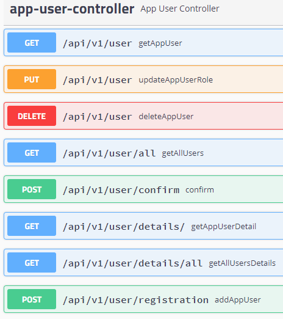

# car-workshop-service

This application has been created for educational purposes.You can test it under this endpoint: "/swagger-ui.html".
To register, please send a post request as shown in the example.

Please be aware that default port is 8080. In this application port has been changed to 8081.

After registration, the system send an email, which includes confirmation link. It is also possible to confirm registration by sending post request:

Users can log in by sending post request:

There are two users who are already added to the db:

role-ADMIN:
username: admin, password: password

role-CLIENT:
username: client, password: password

To use the API Swagger you need obtain authorization by sending JWT token.

Available Api that can be used:

Tests that were performed with JUnit5:

